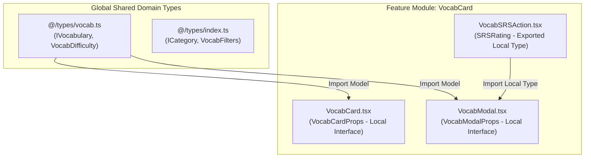

# Picword — Engineering & Architecture Direction Guidelines

> **Version**: 1.1.0  
> **Target Stack**: Next.js 14+ (App Router), TypeScript, Tailwind CSS, Framer Motion  
> **Core Objective**: Build a scalable, maintainable, high-performance visual vocabulary learning application with optimal SEO and modular UI components.

---

## 1. Architectural Philosophy & Principles

To maintain an enterprise-grade codebase as Picword scales, all development must adhere to four foundational principles:

1. **Server-First Rendering**: Default to Server Components (`RSC`). Scope `"use client"` directive strictly to leaf nodes requiring browser events, modal state, or Framer Motion animations.
2. **Strict Type Scoping**: Enforce clear boundaries between local component props and global domain models.
3. **Modal-Driven Detail View**: All word insights, definitions, and AI mnemonics are presented in dynamic modal popups (`VocabModal`), preserving seamless single-page navigation.
4. **ISR-Driven SEO**: Leverage Incremental Static Regeneration (ISR) on catalog/browse routes to deliver static speeds and high search indexing performance.

---

## 2. Directory Structure & Module Organization

The codebase follows a domain-driven, co-located directory structure designed for high discoverability and reusability.

```text
picword/
├── src/
│   ├── app/                      # Next.js App Router (Routes, Layouts, APIs)
│   │   ├── (auth)/               # Auth route group
│   │   ├── (marketing)/          # Landing & static marketing pages
│   │   ├── words/                # Vocabulary browser page
│   │   │   └── page.tsx          # Word list browser (ISR / Dynamic)
│   │   ├── api/                  # Serverless API routes
│   │   ├── layout.tsx            # Root layout with providers & fonts
│   │   ├── page.tsx              # Homepage
│   │   └── globals.css           # Global Tailwind tokens & design system CSS
│   │
│   ├── components/               # UI & Feature Components
│   │   ├── ui/                   # Primitive, headless design tokens (Button, Input, Container)
│   │   ├── layout/               # Global layout components (Navbar, Footer, Sidebar)
│   │   ├── VocabCard/            # Co-located Feature Module (Self-contained)
│   │   │   ├── VocabCard.tsx     # Main card component (Front card + trigger)
│   │   │   ├── VocabModal.tsx    # Modal popup for detailed word insights
│   │   │   ├── VocabModalHeader.tsx
│   │   │   ├── VocabModalTabs.tsx
│   │   │   ├── VocabSRSAction.tsx
│   │   │   └── index.ts          # Public API export barrel
│   │   └── words/                # Domain-specific word page components
│   │       ├── WordsBrowser.tsx  # Catalog browser & modal state orchestrator
│   │       ├── FilterSidebar.tsx
│   │       └── PronounceButton.tsx
│   │
│   ├── data/                     # Static seed datasets & mock fallback data
│   │   ├── vocabularies.ts
│   │   └── categories.ts
│   │
│   ├── hooks/                    # Custom React hooks (Client-side state & side-effects)
│   │   ├── useSavedWords.ts
│   │   └── useAudioPlayer.ts
│   │
│   ├── lib/                      # Core utilities, database clients, AI integrations
│   │   ├── db.ts
│   │   └── utils.ts
│   │
│   └── types/                    # Centralized Shared Domain Types ONLY
│       ├── index.ts              # Export barrel for domain types
│       ├── vocab.ts              # Core IVocabulary model & sub-types
│       └── category.ts           # Category domain models
│
├── docs/                         # Project documentation & guidelines
│   └── PROJECT_DIRECTION.md
└── public/                       # Static public assets (images, audio, icons)
```

---

## 3. Type Control Flow & Governance

Type definitions must be strictly partitioned based on ownership and scope to prevent giant monolithic type files and maintain encapsulation.



### 3.1 Local Component Types (Co-located)
- **Scope**: Props, local component state, event handler parameters, and UI variant enums specific to a single component or its direct sub-components.
- **Location**: Defined within the component file (`.tsx`) or a local `types.ts` inside the component folder.
- **Rule**: Do **NOT** export component props into `@/types` unless they are consumed across 3+ unrelated feature modules.

```tsx
// Example: src/components/VocabCard/VocabCard.tsx

import type { IVocabulary } from "@/types"; // Global domain model import
import type { SRSRating } from "./VocabSRSAction"; // Local sibling type import

/** Local Component Props interface co-located in component file */
export interface VocabCardProps {
  vocab: IVocabulary;
  saved: boolean;
  onToggleSave: (id: string) => void;
  index?: number;
  mode?: "browse" | "recall";
  onSrsRate?: (id: string, rating: SRSRating) => void;
}
```

### 3.2 Centralized Shared Domain Types (`@/types`)
- **Scope**: Core database entities, domain models, API request/response payloads, and global app settings.
- **Location**: `src/types/` directory (`vocab.ts`, `category.ts`, `index.ts`).
- **Rule**: Shared types must remain pure schema definitions with zero runtime React dependency.

```typescript
// Example: src/types/vocab.ts

export type VocabDifficulty = "beginner" | "intermediate" | "advanced";

export interface IVocabulary {
  _id: string;
  word: string;
  phonetic?: string;
  imageUrl: string;
  bengaliMeaning: string;
  englishMeaning: string;
  difficulty: VocabDifficulty;
  category: string;
  createdAt?: Date;
}
```

---

## 4. Rendering Strategy & Performance Matrix

Choose the optimal Next.js rendering strategy per route based on freshness vs performance requirements.

| Route / Page | Strategy | Revalidation / Caching | Rationale |
| :--- | :--- | :--- | :--- |
| **Homepage (`/`)** | **ISR** | `revalidate = 3600` (1 hour) | Fast initial load, cached at CDN edge with periodic updates. |
| **Word List (`/words`)** | **ISR + Modal Popup** | `revalidate = 1800` (30 mins) | Pre-renders initial word list on server for instant load; word deep dives open in dynamic modal popups (`VocabModal`). |
| **User Dashboard (`/dashboard`)** | **SSR / Dynamic Client** | `cache: 'no-store'` | Highly personalized per user, requires fresh user session. |
| **Interactive Widgets (`VocabCard`, `VocabModal`)** | **Client Component (`"use client"`)** | React State / Hydration | Scoped to leaf nodes for modal toggles, animations, tab switches, and audio playback. |

---

## 5. SEO & Indexing Strategy (Modal & Catalog Driven)

Since word details are controlled inside a popup modal (`VocabModal`) rather than separate single pages, SEO is optimized on catalog routes and optional query-param URL states (`/words?word=id`).

### 5.1 Page Metadata Generation
The Vocabulary Browser page defines rich canonical tags, search descriptions, and OpenGraph images representing the vocabulary collection.

```tsx
// Example: src/app/words/page.tsx

import type { Metadata } from "next";

export const metadata: Metadata = {
  title: "Visual English Vocabulary Browser | Picword Dictionary",
  description: "Browse English vocabulary with visual memory prompts, Bengali definitions, AI mnemonics, and interactive recall practice.",
  openGraph: {
    title: "Picword Visual Dictionary Browser",
    description: "Master English vocabulary visually with AI-powered memory aids.",
    images: [{ url: "/og-words.jpg", alt: "Picword Visual Dictionary" }],
  },
  alternates: {
    canonical: "https://picword.app/words",
  },
};
```

### 5.2 Structured Data (JSON-LD ItemList for Rich Indexing)
Embed Schema.org `ItemList` and `DefinedTermSet` JSON-LD data into the main words browser page so search engines index the full catalog of vocabulary terms.

```tsx
import { VOCABULARIES } from "@/data/vocabularies";

export default function WordsPage() {
  const jsonLd = {
    "@context": "https://schema.org",
    "@type": "DefinedTermSet",
    name: "Picword Visual Dictionary Catalog",
    description: "Visual vocabulary dictionary with Bengali meanings and AI mnemonics.",
    hasDefinedTerm: VOCABULARIES.map((v) => ({
      "@type": "DefinedTerm",
      name: v.word,
      description: v.englishMeaning,
      termCode: v._id || v.word,
      image: v.imageUrl,
    })),
  };

  return (
    <>
      <script
        type="application/ld+json"
        dangerouslySetInnerHTML={{ __html: JSON.stringify(jsonLd) }}
      />
      {/* WordsBrowser Component */}
    </>
  );
}
```

---

## 6. Component Quality & Reusability Standards

1. **Export Barrel (`index.ts`)**: Every component folder under `src/components/` must contain a clean `index.ts` re-exporting the primary public component and types.
   ```typescript
   export { default } from "./VocabCard";
   export type { VocabCardProps } from "./VocabCard";
   ```
2. **Prop Validation & Defaults**: Provide explicit default props for optional boolean or mode flags (`mode = "browse"`, `index = 0`).
3. **Accessibility (a11y)**:
   - Provide descriptive `aria-label` tags for icon buttons (e.g., Save button, Audio play button).
   - Support keyboard navigation (`Enter` / `Space` keyhandlers on clickable cards, `Escape` to dismiss modal popups).
4. **Style Consistency**: Rely strictly on Tailwind CSS design tokens defined in `globals.css` and `tailwind.config.js`. Avoid inline magic numbers.

---

## 7. Developer Workflow Checklist

Before committing any feature or refactoring existing components, verify against this checklist:

- [ ] **Type Boundaries**: Are local props kept inside component files and only global models stored in `@/types`?
- [ ] **RSC Boundary**: Is `"use client"` placed strictly at the lowest interactive component level?
- [ ] **Modal Control**: Are detailed word views launched cleanly via `VocabModal` without navigating away from the catalog?
- [ ] **Export Consistency**: Is the component exported cleanly via an `index.ts` barrel?
- [ ] **SEO & Metadata**: Does the page define static or dynamic metadata with canonical URLs?
- [ ] **Image Optimization**: Do `Image` tags use `sizes`, proper `alt` descriptions, and Next.js responsive sizing?
- [ ] **TypeScript Zero Errors**: Does `npx tsc --noEmit` run cleanly without warnings?
