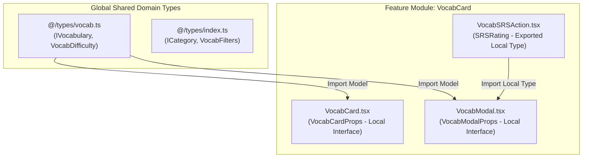

# Visual Vocabulary Platform: Product Requirement Document (PRD)

---

## 1. Executive Summary & Vision

The **Visual Vocabulary Platform** is a Next.js-based, feature-rich web application engineered to transform traditional vocabulary learning into a visual, addictive, and deeply effective learning experience. 

By combining **Cognitive Psychology**, **Data-Driven Spaced Repetition Algorithms**, **Gamification**, and **AI-Powered Personalization**, the platform helps learners retain words up to 3x faster compared to text-only flashcards.

---

## 2. Core Psychological & Immersion Mechanics

To get learners completely absorbed in the experience (Flow State), the system integrates established behavioral psychology principles into every step of the learning flow:

* **Dual-Coding Theory (Paivio):** Every concept pairs verbal definition with strong visual stimuli (image + AI sound-alike visual mnemonic) to create two distinct memory traces in the brain.
* **Flow State Optimization (Yerkes-Dodson Law):** The system dynamically balances challenge and skill level. Exercises adapt to user performance to prevent boredom (too easy) or anxiety (too hard).
* **Interleaved Practice:** Quizzes and review sets mix different categories, parts of speech, and prompt types (visual matching, audio dictation, context fill-in) to build flexible neural connections.
* **Variable Reward Schedule (Skinner Box Mechanics):** Unpredictable XP multipliers, unexpected badge unlocks, and daily streak bonuses trigger dopamine release, keeping motivation high.
* **Loss Aversion & Streak Maintenance:** Visual streak counters combined with protective items ("Streak Freeze") leverage loss aversion to foster daily habits.

---

## 3. Algorithmic Foundation

The learning engine relies on two core algorithms to maximize memory retention and personalize student learning paths.

### 3.1. Free Spaced Repetition System (FSRS)
Outperforming traditional Leitner or SM-2 algorithms, the platform uses FSRS to model memory retention ($R$) based on elapsed time ($t$) and memory stability ($S$):

$$R(t, S) = \left(1 + 0.19 \cdot \frac{t}{S}\right)^{-1}$$

* **User Input Ratings:**
  * `1` — **Again:** Complete failure to recall. Interval resets.
  * `2` — **Hard:** Recalled with significant effort. Minor stability boost.
  * `3` — **Good:** Recalled with normal effort. Target stability interval set.
  * `4` — **Easy:** Recalled effortlessly. Extended stability interval boost.
* **Output:** Calculates exact next review dates to keep user retention around **90%**.

### 3.2. Adaptive Dynamic Mastery Index (DMI)
Calculates overall mastery score ($M \in [0, 100]$) per word for a specific user using a weighted formula:

$$M = (0.40 \cdot R) + (0.25 \cdot C_s) + (0.20 \cdot A_t) - (0.15 \cdot E_r)$$

* $R$: FSRS predicted retention percentage ($0-100$).
* $C_s$: Normalized score for consecutive correct answers in tests ($0-100$).
* $A_t$: Speed score normalized by response speed ($0-100$).
* $E_r$: Error penalty rate based on total contextual quiz failures ($0-100$).

---

## 4. Gamification, Badges & Point System

```text
               [ User Completes Action ]
                          │
       ┌──────────────────┼──────────────────┐
       ▼                  ▼                  ▼
[ Earn XP / Gems ]  [ Daily Streaks ]   [ Skill Badges ]
  • Card Review      • Daily Goal        • Mastery Tiers
  • Quiz Accuracy    • Loss Aversion     • Achievement
  • Speed Bonus      • Streak Freeze       Unlocks
```

### Point System (XP & Gems)
* **XP (Experience Points):** Reflects total learning output. Earned via card reviews (+10 XP), quiz questions (+25 XP), and streak milestones (+100 XP). Determines global and category leaderboard ranks.
* **Linguistic Gems (In-App Currency):** Earned by reaching daily goals and completing test modules. Spent on **Streak Freezes**, **Custom Card Themes**, or **AI Mnemonic Requests**.

### Tiered Badge System
* **Mastery Badges:** Unlocked at total word counts (e.g., *Visual Novice* = 50 words, *Visual Polyglot* = 1,000 words).
* **Category Badges:** Earned by mastering specific domains (e.g., *IELTS Titan*, *GRE Vocabulary Master*, *Corporate Native*).
* **Consistency Badges:** Awarded for consistent study (e.g., *7-Day Catalyst*, *Night Owl Learner*, *30-Day Unstoppable*).

---

## 5. Assessment & Exam System

The exam engine tests vocabulary from multiple cognitive angles:

1. **Visual Matching Time-Attack:** Drag and drop images to matching target vocabulary words within a countdown timer.
2. **Contextual AI Fill-in-the-Blank:** Select or type the correct word to complete dynamic, AI-generated situational sentences (supports English & Bengali context).
3. **Audio-Phonetic Dictation:** Listen to clear native pronunciation audio and type out the word with correct spelling.
4. **Active Recall Flash-Quiz:** View the visual memory trigger only and rate recall before viewing meaning and usage notes.
5. **Adaptive Diagnostic Placement:** Evaluates new users to skip already-mastered words and build a tailored learning program.

---

## 6. Personalized Dashboard Architecture

The dashboard serves as the central command center for user progress and daily learning guidance:

* **Daily Goal Progress Ring:** Visual progress bar tracking reviews done vs. daily target, words learned, and XP earned.
* **Personalized AI Learning Recommendations:** Next-action prompts based on weakness analysis (e.g., *"You have 12 Advanced adjectives in memory decay. Review now to protect your 90% retention rate"*).
* **Memory Retention Curve Graph:** Interactive visualization mapping projected memory retention against overall mastered words.
* **Activity Heatmap:** GitHub-style yearly contribution grid detailing daily activity and streak status.
* **Weakness Spotlight Matrix:** Quick-access list surfacing words with the lowest Dynamic Mastery Index ($M$) for targeted practice.

---

## 7. Technical Requirements & Non-Functional Goals

* **Performance:** Sub-100ms render response time for card interactions, audio playback, and popup modals.
* **Scalability:** Feature-based modular architecture (`src/features/`) capable of supporting high concurrent active sessions.
* **Offline-First Capabilities:** Cache daily review queues locally to allow uninterrupted studying offline, syncing seamlessly when reconnected.
* **Accessibility:** Full WCAG 2.1 AA compliance, complete keyboard accessibility for reviews/quizzes, and high-contrast support.


================================================================
================================================================

# Picword — Engineering & Architecture Direction Guidelines

> **Version**: 1.1.0  
> **Target Stack**: Next.js 14+ (App Router), TypeScript, Tailwind CSS, Framer Motion  
> **Core Objective**: Build a scalable, maintainable, high-performance visual vocabulary learning application with optimal SEO and modular UI components.

---

## 1. Architectural Philosophy & Principles

To maintain an enterprise-grade codebase as Picword scales, all development must adhere to four foundational principles:

1. **Server-First Rendering**: Default to Server Components (`RSC`). Scope `"use client"` directive strictly to leaf nodes requiring browser events, modal state, or Framer Motion animations.
2. **Strict Type Scoping**: Enforce clear boundaries between local component props and global domain models.
3. **Modal-Driven Detail View**: All word insights, definitions, and AI mnemonics are presented in dynamic modal popups (`VocabModal`), preserving seamless single-page navigation.
4. **ISR-Driven SEO**: Leverage Incremental Static Regeneration (ISR) on catalog/browse routes to deliver static speeds and high search indexing performance.

---

## 2. Directory Structure & Module Organization

The codebase follows a domain-driven, co-located directory structure designed for high discoverability and reusability.

```text
picword/
├── src/
│   ├── app/                      # Next.js App Router (Routes, Layouts, APIs)
│   │   ├── admin/                # Admin Panel Management Module
│   │   │   ├── vocabularies/     # Vocab CRUD & AI Mnemonics Manager
│   │   │   │   ├── page.tsx      # Vocab Datatable Manager
│   │   │   │   └── new/page.tsx  # Add Vocabulary Form
│   │   │   ├── categories/       # Category Matrix Manager
│   │   │   ├── users/            # Learner Stats & Progress
│   │   │   ├── layout.tsx        # Admin Sidebar & Header Layout
│   │   │   └── page.tsx          # Admin Overview Dashboard
│   │   ├── words/                # Vocabulary browser page
│   │   │   └── page.tsx          # Word list browser (ISR / Dynamic)
│   │   ├── api/                  # Serverless API routes (Learner & Admin APIs)
│   │   ├── layout.tsx            # Root layout with providers & fonts
│   │   ├── page.tsx              # Learner Homepage
│   │   └── globals.css           # Global Tailwind tokens & design system CSS
│   │
│   ├── components/               # UI & Feature Components
│   │   ├── admin/                # Admin Panel Specific Components
│   │   │   ├── AdminSidebar.tsx  # Dedicated Admin Sidebar Navigation
│   │   │   ├── AdminHeader.tsx   # Admin Header & Status Bar
│   │   │   └── index.ts          # Barrel export
│   │   ├── home/                 # Homepage modular sections
│   │   ├── ui/                   # Primitive, headless design tokens (Button, Input, Container)
│   │   ├── layout/               # Global layout components (Navbar, Footer, ThemeToggle)
│   │   ├── VocabCard/            # Co-located Feature Module (Self-contained)
│   │   └── words/                # Domain-specific word page components
│   │
│   ├── data/                     # Static seed datasets & mock fallback data
│   │   ├── vocabularies.ts
│   │   └── categories.ts
│   │
│   ├── hooks/                    # Custom React hooks (Client-side state & side-effects)
│   ├── lib/                      # Core utilities, database clients, AI integrations
│   │   ├── db.ts
│   │   └── utils.ts
│   │
│   └── types/                    # Centralized Shared Domain Types ONLY
│       ├── index.ts              # Export barrel for domain types
│       ├── vocab.ts              # Core IVocabulary model & sub-types
│       └── category.ts           # Category domain models
│
├── docs/                         # Project documentation & guidelines
│   └── PROJECT_DIRECTION.md
└── public/                       # Static public assets (images, audio, icons)
```

---

## 3. Type Control Flow & Governance

Type definitions must be strictly partitioned based on ownership and scope to prevent giant monolithic type files and maintain encapsulation.



### 3.1 Local Component Types (Co-located)
- **Scope**: Props, local component state, event handler parameters, and UI variant enums specific to a single component or its direct sub-components.
- **Location**: Defined within the component file (`.tsx`) or a local `types.ts` inside the component folder.
- **Rule**: Do **NOT** export component props into `@/types` unless they are consumed across 3+ unrelated feature modules.

```tsx
// Example: src/components/VocabCard/VocabCard.tsx

import type { IVocabulary } from "@/types"; // Global domain model import
import type { SRSRating } from "./VocabSRSAction"; // Local sibling type import

/** Local Component Props interface co-located in component file */
export interface VocabCardProps {
  vocab: IVocabulary;
  saved: boolean;
  onToggleSave: (id: string) => void;
  index?: number;
  mode?: "browse" | "recall";
  onSrsRate?: (id: string, rating: SRSRating) => void;
}
```

### 3.2 Centralized Shared Domain Types (`@/types`)
- **Scope**: Core database entities, domain models, API request/response payloads, and global app settings.
- **Location**: `src/types/` directory (`vocab.ts`, `category.ts`, `index.ts`).
- **Rule**: Shared types must remain pure schema definitions with zero runtime React dependency.

```typescript
// Example: src/types/vocab.ts

export type VocabDifficulty = "beginner" | "intermediate" | "advanced";

export interface IVocabulary {
  _id: string;
  word: string;
  phonetic?: string;
  imageUrl: string;
  bengaliMeaning: string;
  englishMeaning: string;
  difficulty: VocabDifficulty;
  category: string;
  createdAt?: Date;
}
```

---

## 4. Rendering Strategy & Performance Matrix

Choose the optimal Next.js rendering strategy per route based on freshness vs performance requirements.

| Route / Page | Strategy | Revalidation / Caching | Rationale |
| :--- | :--- | :--- | :--- |
| **Homepage (`/`)** | **ISR** | `revalidate = 3600` (1 hour) | Fast initial load, cached at CDN edge with periodic updates. |
| **Word List (`/words`)** | **ISR + Modal Popup** | `revalidate = 1800` (30 mins) | Pre-renders initial word list on server for instant load; word deep dives open in dynamic modal popups (`VocabModal`). |
| **User Dashboard (`/dashboard`)** | **SSR / Dynamic Client** | `cache: 'no-store'` | Highly personalized per user, requires fresh user session. |
| **Interactive Widgets (`VocabCard`, `VocabModal`)** | **Client Component (`"use client"`)** | React State / Hydration | Scoped to leaf nodes for modal toggles, animations, tab switches, and audio playback. |

---

## 5. SEO & Indexing Strategy (Modal & Catalog Driven)

Since word details are controlled inside a popup modal (`VocabModal`) rather than separate single pages, SEO is optimized on catalog routes and optional query-param URL states (`/words?word=id`).

### 5.1 Page Metadata Generation
The Vocabulary Browser page defines rich canonical tags, search descriptions, and OpenGraph images representing the vocabulary collection.

```tsx
// Example: src/app/words/page.tsx

import type { Metadata } from "next";

export const metadata: Metadata = {
  title: "Visual English Vocabulary Browser | Picword Dictionary",
  description: "Browse English vocabulary with visual memory prompts, Bengali definitions, AI mnemonics, and interactive recall practice.",
  openGraph: {
    title: "Picword Visual Dictionary Browser",
    description: "Master English vocabulary visually with AI-powered memory aids.",
    images: [{ url: "/og-words.jpg", alt: "Picword Visual Dictionary" }],
  },
  alternates: {
    canonical: "https://picword.app/words",
  },
};
```

### 5.2 Structured Data (JSON-LD ItemList for Rich Indexing)
Embed Schema.org `ItemList` and `DefinedTermSet` JSON-LD data into the main words browser page so search engines index the full catalog of vocabulary terms.

```tsx
import { VOCABULARIES } from "@/data/vocabularies";

export default function WordsPage() {
  const jsonLd = {
    "@context": "https://schema.org",
    "@type": "DefinedTermSet",
    name: "Picword Visual Dictionary Catalog",
    description: "Visual vocabulary dictionary with Bengali meanings and AI mnemonics.",
    hasDefinedTerm: VOCABULARIES.map((v) => ({
      "@type": "DefinedTerm",
      name: v.word,
      description: v.englishMeaning,
      termCode: v._id || v.word,
      image: v.imageUrl,
    })),
  };

  return (
    <>
      <script
        type="application/ld+json"
        dangerouslySetInnerHTML={{ __html: JSON.stringify(jsonLd) }}
      />
      {/* WordsBrowser Component */}
    </>
  );
}
```

---

## 6. Component Quality & Reusability Standards

1. **Export Barrel (`index.ts`)**: Every component folder under `src/components/` must contain a clean `index.ts` re-exporting the primary public component and types.
   ```typescript
   export { default } from "./VocabCard";
   export type { VocabCardProps } from "./VocabCard";
   ```
2. **Prop Validation & Defaults**: Provide explicit default props for optional boolean or mode flags (`mode = "browse"`, `index = 0`).
3. **Accessibility (a11y)**:
   - Provide descriptive `aria-label` tags for icon buttons (e.g., Save button, Audio play button).
   - Support keyboard navigation (`Enter` / `Space` keyhandlers on clickable cards, `Escape` to dismiss modal popups).
4. **Style Consistency**: Rely strictly on Tailwind CSS design tokens defined in `globals.css` and `tailwind.config.js`. Avoid inline magic numbers.

---

## 7. Developer Workflow Checklist

Before committing any feature or refactoring existing components, verify against this checklist:

- [ ] **Type Boundaries**: Are local props kept inside component files and only global models stored in `@/types`?
- [ ] **RSC Boundary**: Is `"use client"` placed strictly at the lowest interactive component level?
- [ ] **Modal Control**: Are detailed word views launched cleanly via `VocabModal` without navigating away from the catalog?
- [ ] **Export Consistency**: Is the component exported cleanly via an `index.ts` barrel?
- [ ] **SEO & Metadata**: Does the page define static or dynamic metadata with canonical URLs?
- [ ] **Image Optimization**: Do `Image` tags use `sizes`, proper `alt` descriptions, and Next.js responsive sizing?
- [ ] **TypeScript Zero Errors**: Does `npx tsc --noEmit` run cleanly without warnings?


=======================================================
Project completion flow....
=======================================================
graph TD
    P1["Phase 1: Foundation & FSRS Algorithm<br/>(Core Review Engine & Persistence)"]
    P2["Phase 2: Gamification & Economy<br/>(XP, Gems, Badges, Streaks)"]
    P3["Phase 3: Interactive Assessment Suite<br/>(Visual Match, Dictation, Fill-in)"]
    P4["Phase 4: Intelligent Learning Dashboard<br/>(Heatmap, Retention Curve, Weakness Matrix)"]
    P5["Phase 5: Offline-First & Sound Engine<br/>(IndexedDB Cache, Audio Sync)"]

    P1 --> P2
    P2 --> P3
    P3 --> P4
    P4 --> P5


======================================================================
📌 Phase 1: Algorithmic Core — FSRS & Local State Persistence
FSRS Calculation Engine (src/lib/fsrs.ts):
Implement memory stability ($S$) and retention ($R(t, S) = (1 + 0.19 \cdot \frac{t}{S})^{-1}$) math.
Calculate next review dates for Again (1), Hard (2), Good (3), and Easy (4) ratings.
Dynamic Mastery Index (DMI) Engine (src/lib/dmi.ts):
Implement $M = (0.40R) + (0.25C_s) + (0.20A_t) - (0.15E_r)$ to track per-word mastery ($0–100%$).
FSRS Review Store Hook (src/hooks/useFSRSSession.ts):
Track user reviews, retention states, and due queues with localStorage fallback and database sync.
📌 Phase 2: Gamification & Reward Economy
Experience & Gem Engine (src/hooks/useGamification.ts):
XP tracking (+10 review, +25 quiz, +100 streak).
Linguistic Gems currency for streak freezes and custom theme perks.
Daily Streak & Loss Aversion:
Streak tracking with streak-freeze preservation.
Tiered Badges System (src/data/badges.ts & BadgeModal.tsx):
Mastery Badges (Visual Novice, Polyglot), Category Badges (IELTS Titan, GRE Master), Consistency Badges (7-Day Catalyst, Night Owl).
📌 Phase 3: Interactive Multi-Modal Assessment Engine (/quiz)
5 Quiz Modalities:
Visual Matching Time-Attack: Match imagery to vocabulary before the countdown ends.
Contextual AI Fill-in-the-Blank: Dynamic English & Bengali cloze test.
Audio-Phonetic Dictation: Audio listening test with spelling validation.
Active Recall Flash-Quiz: Dual-sided image & prompt evaluation.
Diagnostic Placement Test: Quick skill assessment for new learners.
📌 Phase 4: Personalized Learning Dashboard (/dashboard)
Daily Goal Ring: Interactive visual progress tracking (Cards reviewed, XP earned).
Memory Retention Curve Visualization: Projected memory retention decay graph vs. mastered words.
Activity Heatmap: 365-day GitHub-style contribution grid with streak indicators.
Weakness Spotlight Matrix: Surfacing lowest DMI ($M$) words for priority review.
📌 Phase 5: Production Polish & Offline-First Cache
IndexedDB Offline Review Queue: Study anywhere without an internet connection, automatically syncing back online.
Sound & Keyboard Shortcuts: Native audio controls and fast keyboard navigation (1, 2, 3, 4 for SRS grading, Space to flip).
🚀 Recommended Next Step
We can begin with Phase 1: Algorithmic Core (FSRS Retention & Dynamic Mastery Index engine) so all card ratings (Again, Hard, Good, Easy) calculate realistic spaced review intervals and save progress persistently.
